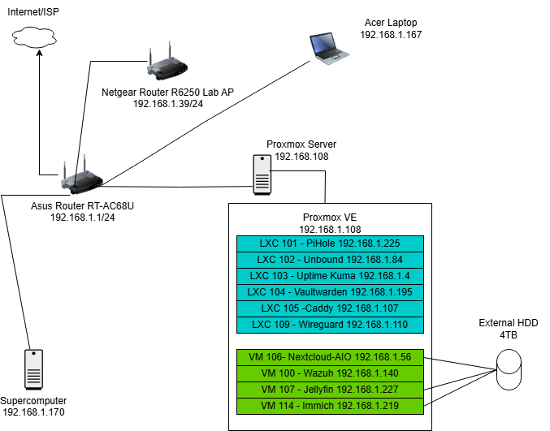

# security-labs

This repository documents a home network and homelab platform built for hands-on learning in infrastructure, security operations, and system administration — with a focus on resume-building projects targeting SOC/blue team roles.

The environment runs on a flat home network (`192.168.1.0/24`) with Proxmox VE as the hypervisor. Services are deployed as Linux containers (LXCs) or VMs depending on workload requirements.

---

## Current Lab State

### Hardware

| Component | Details |
|-----------|---------|
| Hypervisor | Proxmox VE — bare metal (`lab-pve`, 192.168.1.108) |
| RAM | 32GB DDR3 |
| Storage | 4TB external HDD (`/dev/sdb`) — partitioned for backups, Nextcloud, and general storage |
| Network | ASUS RT-AC68U (primary router, DHCP/NAT) + Netgear R6250 (AP mode) |
| Switch | TP-Link TL-SG108PE V3 (managed, 192.168.1.200) — VLAN config in progress with OPNsense |

### Storage Layout (4TB External HDD)

| Partition | Size | Mount | Purpose |
|-----------|------|-------|---------|
| sdb1 | 465GB | `/mnt/pve/backup-hdd` | Proxmox VM/LXC backups |
| sdb2 | 465GB | `/mnt/pve/nextcloud-aio` | Nextcloud AIO data |
| sdb3 | 2.7TB | `/mnt/pve/storage` | Immich photos, Jellyfin metadata, general storage |

---

## Services

### Infrastructure

| Service | Type | ID | IP | Notes |
|---------|------|----|----|-------|
| Proxmox VE | Bare metal | — | 192.168.1.108 | Hypervisor for all lab workloads |
| Pi-hole | LXC 101 | Debian 12 | 192.168.1.225 | Network-wide DNS filtering and ad blocking |
| Unbound | LXC 102 | Debian 12 | 192.168.1.84 | Recursive DNS resolver — Pi-hole upstream |
| Caddy | LXC 105 | Debian 12 | 192.168.1.107 | Reverse proxy with Let's Encrypt wildcard cert via Cloudflare DNS challenge |
| WireGuard (wg-easy) | LXC 109 | Debian 12 | 192.168.1.110 | Remote VPN access via DDNS (`snoopylab23.asuscomm.com:51820`) |
| OPNsense | VM 111 | — | 192.168.1.254 | Firewall/router VM — VLAN config in progress with managed switch |

### Security

| Service | Type | ID | IP | Notes |
|---------|------|----|----|-------|
| Wazuh SIEM | VM 100 | Ubuntu 22.04 | 192.168.1.140 | Full SIEM stack — manager, indexer, dashboard (v4.14.3) |
| Cowrie Honeypot | LXC 108 | Debian 12 | 192.168.1.186 | SSH honeypot on port 22 via iptables redirect — logs feed into Wazuh via custom rules |

### Monitoring

| Service | Type | ID | IP | Notes |
|---------|------|----|----|-------|
| Uptime Kuma | LXC 103 | Debian 12 | 192.168.1.4 | Service uptime monitoring with Discord alerts |

### Self-Hosted Apps

| Service | Type | ID | IP | Notes |
|---------|------|----|----|-------|
| Vaultwarden | LXC 104 | Debian 12 | 192.168.1.195 | Self-hosted Bitwarden-compatible password manager |
| Jellyfin | VM 107 | Ubuntu 22.04 | 192.168.1.223 | Media server — metadata on sdb3, media via SMB from Supercomputer |
| Nextcloud AIO | VM 106 | Ubuntu 22.04 | 192.168.1.56 | File storage and collaboration (v12.8.0 with built-in Collabora) |
| Immich | VM 114 | Ubuntu 22.04 | 192.168.1.219 | Self-hosted photo/video backup (Google Photos alternative) |
| Authentik | VM 112 | Ubuntu 22.04 | 192.168.1.44 | SSO — OAuth2/OIDC provider, Portainer integrated |
| Actual Budget + Portainer | LXC 115 | Debian 12 | 192.168.1.240 | Personal finance tracker (port 5006) + Portainer CE (port 9443) |

---

## Internal DNS + Reverse Proxy

All services are accessible via `.meadows-lab.com` subdomains, managed by Pi-hole DNS and Caddy reverse proxy with trusted Let's Encrypt wildcard cert (`*.meadows-lab.com`) via Cloudflare DNS-01 challenge.

| Domain | Service |
|--------|---------|
| vault.meadows-lab.com | Vaultwarden |
| pihole.meadows-lab.com | Pi-hole admin |
| nextcloud.meadows-lab.com | Nextcloud |
| immich.meadows-lab.com | Immich |
| kuma.meadows-lab.com | Uptime Kuma |
| wireguard.meadows-lab.com | WireGuard web UI |
| jellyfin.meadows-lab.com | Jellyfin |
| wazuh.meadows-lab.com | Wazuh dashboard |
| proxmox.meadows-lab.com | Proxmox VE |
| authentik.meadows-lab.com | Authentik SSO |
| actual.meadows-lab.com | Actual Budget |
| portainer.meadows-lab.com | Portainer |

---

## Wazuh Agent Enrollment

Wazuh monitors 11 agents across the lab. All agents must match server version (4.14.3).

| Agent | ID | IP | Version | Status |
|-------|----|----|---------|--------|
| pihole-01 | 001 | 192.168.1.225 | 4.14.3 | ✅ Active |
| unbound-01 | 002 | 192.168.1.84 | 4.14.3 | ✅ Active |
| uptime-kuma-01 | 003 | 192.168.1.4 | 4.14.3 | ✅ Active |
| vaultwarden-01 | 004 | 192.168.1.195 | 4.14.3 | ✅ Active |
| caddy-01 | 005 | 192.168.1.107 | 4.14.3 | ✅ Active |
| wireguard-01 | 006 | 192.168.1.110 | 4.14.3 | ✅ Active |
| nextcloud-aio-02 | 007 | 192.168.1.56 | 4.14.0 | ✅ Active |
| immich-01 | 009 | 192.168.1.219 | 4.14.3 | ✅ Active |
| cowrie-01 | 010 | 192.168.1.186 | 4.14.3 | ✅ Active |
| lab-pve | 012 | 192.168.1.108 | 4.14.3 | ✅ Active |
| jellyfin-02 | 013 | 192.168.1.223 | 4.14.3 | ✅ Active |

---

## Backups

- Proxmox backup job runs daily at 21:00
- Retention: last 7 backups
- Target: `sdb1` (`/mnt/pve/backup-hdd`)
- Covers VMs/LXCs: 100, 101, 102, 103, 104, 105, 106, 107, 109, 112, 114, 115

---

## Network Diagram

---

## In Progress

- **Active Directory Lab** — Windows Server VM on Proxmox, AD DS, monitored by Wazuh. ISO ready. RAM available.
- **OPNsense + VLANs** — OPNsense installed at 192.168.1.254. VLAN 10 (trusted), VLAN 20 (IoT), VLAN 30 (DMZ) planned. Managed switch ready.
- **CIS Benchmark Hardening** — pihole-01 at 53%. Rolling out to remaining agents.
- **Wazuh Custom Rules** — Cowrie rules written and confirmed firing. More detection rules and attack simulations planned.

---

## Planned (Next Phase)

1. **Active Directory Lab** — Windows Server VM, AD DS, Wazuh monitoring.
2. **OPNsense VLANs** — Configure VLAN 10/20/30 on managed switch alongside OPNsense.
3. **Cowrie Internet Exposure** — Expose cowrie-01 to internet after VLAN/DMZ is configured to capture real attack data.
4. **Wazuh Discord Alerts** — Push real-time notifications when Cowrie and other rules fire.
5. **Home Assistant** — RAM now available. Attempt after AD lab.
6. **SSH Key Auth** — Roll out labadmin + key auth to remaining LXCs.

---

## Setup Docs

Detailed setup notes for each service are in the repo:

- [Pi-hole + Unbound](pihole-unbound-setup.md)
- [Uptime Kuma](uptime-kuma-setup.md)
- [WireGuard (wg-easy)](wireguard-setup.md)
- [Wazuh SIEM](wazuh-04.md)
- [Nextcloud AIO](nextcloud-setup.md)
- [Immich](immich-setup.md)
- [HDD Partition Layout](hdd-partition-layout.md)
- [Domain + Wildcard Cert Migration](domain-cert-migration.md)
- [Portainer](portainer-setup.md)
