# Active Directory Attack Lab — Brute Force & Kerberoasting Detection

## Overview

This lab simulates two common Active Directory credential attacks — RDP brute force and Kerberoasting — against a Windows Server 2019 domain controller running in a Proxmox home lab. Both attacks are detected by Wazuh using custom rules with MITRE ATT&CK tagging.

**Environment:**
- Domain Controller: `win-server-01` (VM 113) — Windows Server 2019, meadows-lab.local
- Attacker: `kali-02` (VM) — Kali Linux 2025.4
- SIEM: Wazuh 4.x (wazuh-04)
- Sysmon installed on win-server-01 with SwiftOnSecurity config

---

## Part 1 — RDP Brute Force (MITRE T1110)

### AD Setup

Active Directory Domain Services deployed on win-server-01. Organizational Units created: IT, HR, Finance, Workstations. Users created in each OU with weak passwords by design for attack simulation. The `labadmin` account in the IT OU was added to Domain Admins as the primary target.

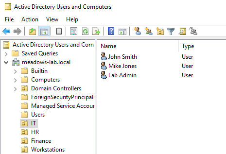

*IT OU showing John Smith, Mike Jones, and Lab Admin — intentionally weak passwords for lab use.*

---

### Attack — Hydra RDP Brute Force

RDP brute force launched from kali-01 against win-server-01 (192.168.1.150) using Hydra and the rockyou.txt wordlist:

```bash
hydra -l labadmin -P rockyou.txt 192.168.1.150 rdp
```

The attack queued 14 million password attempts over RDP (port 3389).

---

### Detection — Event ID 4625 Flood

Windows logged thousands of Event ID 4625 (failed logon) events. Wazuh forwarded all Security channel events and the flood was visible immediately in Discover.

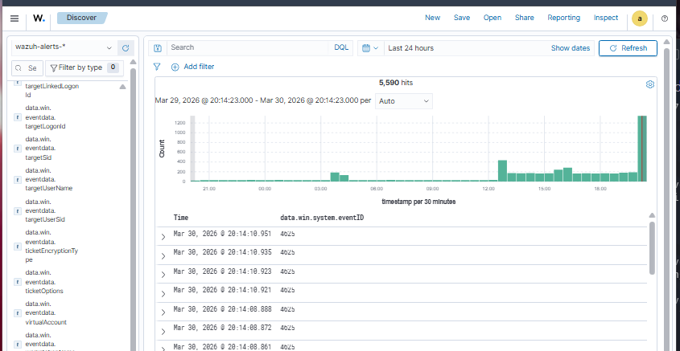

*5,590 failed logon events from 192.168.1.139 (kali-01) targeting labadmin via NTLM over RDP.*

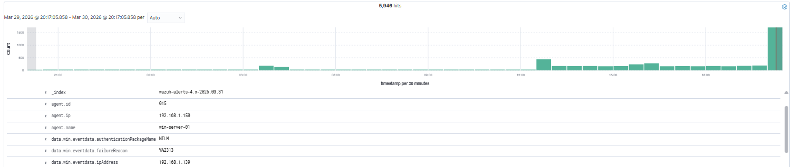

*Alert detail confirming attacker IP 192.168.1.139, authentication package NTLM, agent win-server-01.*

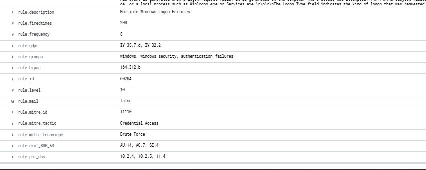

*Wazuh built-in rule 60204 firing at level 10 — MITRE T1110 Brute Force, Credential Access.*

---

### Custom Rule — 100010

A custom rule was written to fire at level 12 when 5 or more 4625 events occur within 120 seconds against the same target username:

```xml
<rule id="100010" level="12" frequency="5" timeframe="120">
  <if_matched_sid>60122</if_matched_sid>
  <same_field>win.eventdata.targetUserName</same_field>
  <description>Brute force attack detected: multiple failed logons for $(win.eventdata.targetUserName)</description>
  <mitre>
    <id>T1110</id>
  </mitre>
  <group>windows,authentication_failed</group>
</rule>
```

---

## Part 2 — Kerberoasting (MITRE T1558.003)

### Creating a Kerberoastable Target

A service account `sqlsvc` was created in Active Directory with a MSSQLSvc Service Principal Name (SPN), making it a valid Kerberoasting target. Any domain user can request a service ticket for an SPN — the ticket is encrypted with the service account's password hash and can be cracked offline.

```powershell
New-ADUser -Name "sqlsvc" -AccountPassword (ConvertTo-SecureString "Password123!" -AsPlainText -Force) -Enabled $true
Set-ADUser -Identity sqlsvc -ServicePrincipalNames @{Add="MSSQLSvc/win-server-01.meadows-lab.local:1433"}
```

SPN confirmed:

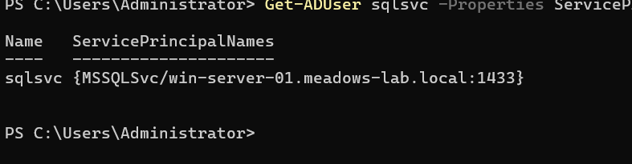

*`Get-ADUser sqlsvc -Properties ServicePrincipalNames` confirming MSSQLSvc SPN registered.*

---

### Attack — Impacket GetUserSPNs

Kerberoasting attack run from kali-02 using Impacket. The tool requests a Kerberos service ticket for every SPN it finds and returns the ticket hash for offline cracking:

```bash
impacket-GetUserSPNs meadows-lab.local/attacker:Password1 -dc-ip 192.168.1.150 -request
```

The `$krb5tgs$23$` hash for sqlsvc was captured — `23` indicates RC4-HMAC encryption (etype 23), the weak legacy cipher that makes Kerberoasting possible.

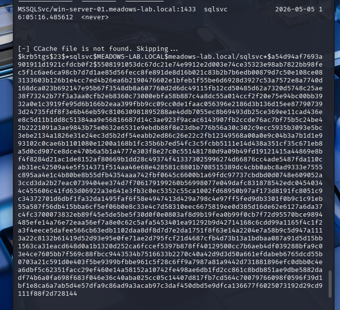

*Kerberos TGS hash captured: `$krb5tgs$23$*sqlsvc$MEADOWS-LAB.LOCAL$...` — RC4 encrypted, ready for offline cracking.*

---

### Hash Cracking — John the Ripper

Hash saved to `kerberoast.hash` and cracked using John the Ripper with a custom wordlist:

```bash
john --wordlist=custom.txt kerberoast.hash
```

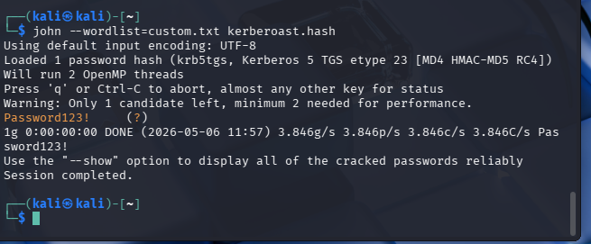

*Password cracked: `Password123!` — confirming the weak service account password.*

The attack was run a second time to generate a fresh hash for Wazuh detection testing:

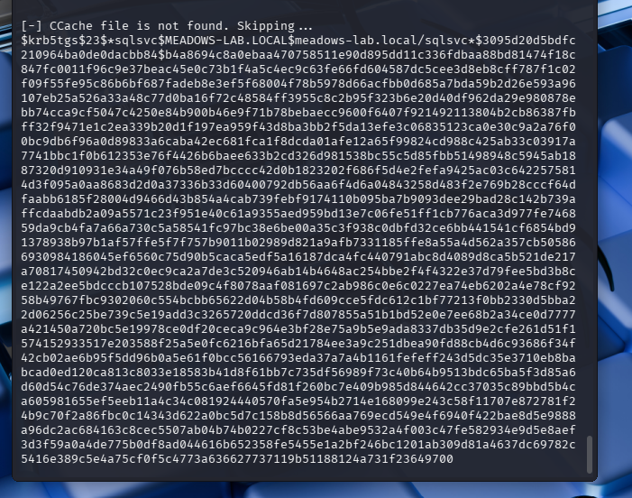

---

### Windows Logging — Event ID 4769

Windows logged Kerberos service ticket requests (Event ID 4769) locally. Confirmed via PowerShell on win-server-01:

```powershell
Get-WinEvent -LogName Security | Where-Object {$_.Id -eq 4769} | Select-Object -First 5
```

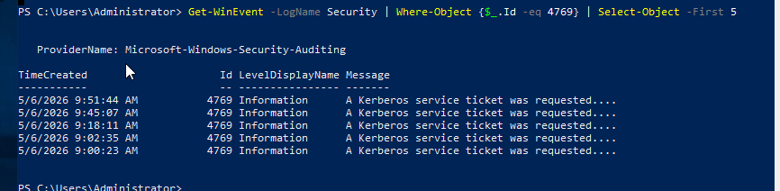

*Five Event ID 4769 entries logged — "A Kerberos service ticket was requested." Windows is capturing the attack activity.*

---

### Custom Rule — 100020

A custom Wazuh rule was written to detect RC4-encrypted Kerberos service ticket requests (Ticket Encryption Type `0x17`), which is the signature of Kerberoasting. The rule excludes normal machine account ticket requests (`krbtgt`):

```xml
<rule id="100020" level="12">
  <if_sid>60106</if_sid>
  <field name="win.system.eventID">^4769$</field>
  <field name="win.eventdata.serviceName" negate="yes">krbtgt</field>
  <description>Possible Kerberoasting attack: RC4 encrypted Kerberos service ticket requested for $(win.eventdata.serviceName)</description>
  <mitre>
    <id>T1558.003</id>
  </mitre>
  <group>windows,kerberoasting,credential_access</group>
</rule>
```

**Troubleshooting note:** The rule initially used `<if_sid>92652</if_sid>` which did not match. By querying the Wazuh archives directly, the 4769 events were confirmed to be matching rule `60106` — updating `if_sid` to `60106` caused the rule to fire immediately on the next attack.

---

### Detection — Rule 100020 Firing

After reloading the Wazuh ruleset and re-running the Kerberoasting attack, rule 100020 fired:

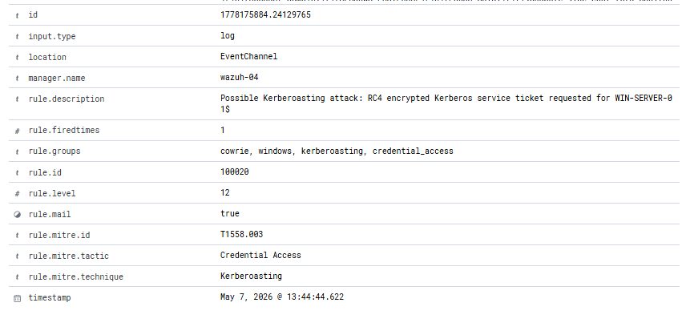

*Rule 100020 — level 12, MITRE T1558.003, Kerberoasting, Credential Access. Timestamp: May 7, 2026 @ 13:44:44.*

---

### Discord Alert

Wazuh Discord integration pushed the alert in real time:

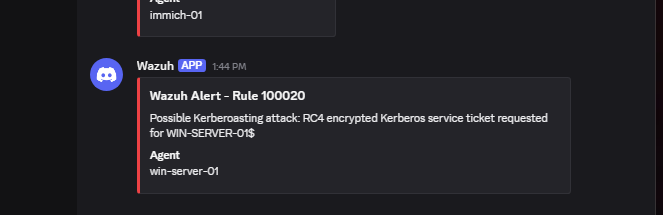

*Discord notification confirming rule 100020 fired against win-server-01.*

---

## Detection Summary

| Attack | MITRE Technique | Event ID | Custom Rule | Level |
|--------|----------------|----------|-------------|-------|
| RDP Brute Force | T1110 — Brute Force | 4625 | 100010 | 12 |
| Kerberoasting | T1558.003 — Kerberoasting | 4769 | 100020 | 12 |

---

## Key Takeaways

- Service accounts with SPNs and weak passwords are trivially Kerberoastable — the ticket is handed out to any authenticated domain user, no admin access required
- RC4 encryption (etype 23 / `0x17`) on a service ticket is a strong Kerberoasting indicator — modern environments should enforce AES-only
- Event ID 4769 is logged on the domain controller for every service ticket request — filtering for RC4 encryption type and non-machine accounts is an effective detection strategy
- Wazuh `if_sid` must match the rule ID that the event actually triggers — validating against live archive data is the correct troubleshooting approach
