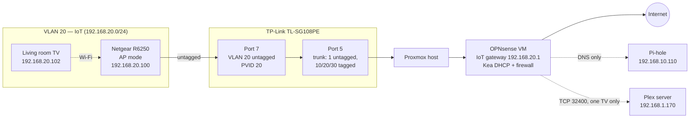

# IoT VLAN 20 — Building an Isolated Wi-Fi Network for Smart Devices

**Date:** October 3–4, 2026
**Status:** Live and verified. First device (living room TV) migrated.

## Overview

Smart TVs, thermostats, and cameras are some of the least trustworthy devices on a home network: closed firmware, infrequent updates, and constant traffic to vendor clouds. Until now they sat on the same flat network as personal laptops and phones.

This build puts them on their own segment, **VLAN 20 (192.168.20.0/24)**, which can reach the internet but nothing else: not the lab (VLAN 10), not the DMZ (VLAN 30), not the household network. The one exception is a single, narrowly scoped rule letting one TV reach the Plex server.

VLAN 20 had existed in OPNsense since April, but nothing could join it, because there was no access point broadcasting into it. The missing piece turned out to be hardware already on the shelf: a retired Netgear R6250 router.

## Topology

## Design Decision: AP Mode, Not Router Mode

The original plan was to run the Netgear in **router mode** with its own VLAN settings, which are greyed out in AP mode on stock firmware. That was dropped in favor of a simpler design:

- The Netgear runs as a **plain access point**: no DHCP, no NAT, no routing. It just bridges Wi-Fi onto its uplink cable.
- The **switch** decides which network that cable belongs to. Port 7 is an access port on VLAN 20, so everything the Netgear sends lands on IoT without the Netgear knowing VLANs exist.

Benefits:

- **No double NAT.** OPNsense and Pi-hole see each IoT device individually, which makes per-device firewall rules, DHCP reservations, and future packet captures possible.
- **One fewer router to manage** and no "network inside a network" to troubleshoot.
- **Not tied to the firewall hardware.** The AP and switch port carry over unchanged when OPNsense moves from a VM to dedicated hardware.

The trade-off is that every SSID on the Netgear lands on the same VLAN. That's fine for an IoT-only AP. A future multi-VLAN AP would need a VLAN-aware access point.

## Build Steps

The build was done in dependency order: OPNsense first, then the switch, and the access point last, so nothing was plugged in until everything it depended on was ready.

### 1. OPNsense: DHCP (Kea)

Kea DHCPv4 was already serving the DMZ, IoT, and Trusted interfaces, with an IoT pool of `192.168.20.100–200`. Three problems were found and fixed before any device joined:

| Finding | Risk | Fix |
|---|---|---|
| **Auto-collect option data** was on | Kea would hand out OPNsense (192.168.20.1) as the DNS server, but the IoT firewall blocks access to it, so devices would join Wi-Fi with no working DNS | Disabled auto-collect; set gateway `192.168.20.1` and DNS `192.168.10.110` (Pi-hole) explicitly |
| An **NTP server** of 192.168.20.1 was auto-filled | Blocked by the same rule; devices would fail to sync time | Removed. Devices fall back to public NTP over the allowed internet rule |
| A leftover **192.168.1.0/24 subnet** from a past hardware cutover attempt | Inactive, but a second DHCP server on the household network caused a multi-day outage in August | Deleted |

### 2. OPNsense: Firewall Rules

The existing IoT rule set had the right shape but a **stale destination**: the DNS allow rule still pointed at Pi-hole's pre-migration address (`192.168.1.225`). Pi-hole had moved to `192.168.10.110` months earlier. Every IoT device would have connected to Wi-Fi and silently failed DNS.

Final rule order (first match wins):

| # | Action | Source | Destination | Port | Purpose |
|---|---|---|---|---|---|
| 1 | Pass | IoT net | 192.168.10.110/32 | 53 TCP/UDP | DNS to Pi-hole only |
| 2 | Pass | 192.168.20.102/32 | 192.168.1.170/32 | 32400 TCP | Living room TV → Plex |
| 3 | Block | IoT net | 192.168.0.0/16 | any | No access to any private network |
| 4 | Pass | IoT net | any | any | Internet |

Both allow rules use **/32 destinations**, one host each, so they open exactly one service rather than a whole subnet. The Plex rule's **source** is also a single host, so other IoT devices (camera, thermostat) cannot reach Plex at all.

### 3. Switch: Port 7 as an IoT Access Port

On the TP-Link TL-SG108PE, three changes turn port 7 into an IoT-only port:

1. **VLAN 20 membership:** port 7 added as **untagged** (ports 5 and 8 remain tagged trunks).
2. **PVID:** port 7 set to **20**, so untagged traffic arriving from the AP is assigned to VLAN 20.
3. **VLAN 1 membership:** port 7 **removed** from the default VLAN, so household broadcasts (including the main router's DHCP offers) can't leak onto IoT.

Final VLAN table:

| VLAN | Name | Member ports | Tagged | Untagged |
|---|---|---|---|---|
| 1 | Default | 1–6, 8 | — | 1–6, 8 |
| 10 | Trusted | 5, 8 | 5, 8 | — |
| 20 | IoT | 5, 7, 8 | 5, 8 | 7 |
| 30 | DMZ | 5, 8 | 5, 8 | — |

Port 8 is pre-staged as a trunk for the future dedicated OPNsense box.

### 4. Access Point: Netgear R6250

Configured on its own, with no uplink cable, before connecting it to the network:

1. Renamed both SSIDs (2.4 GHz and 5 GHz) and set a new WPA2 passphrase.
2. Enabled **AP mode** with dynamic IP. Its built-in DHCP server and router functions are disabled.
3. Connected its internet port to switch port 7.

The 2.4 GHz band serves low-bandwidth devices that only support 2.4 GHz (thermostat, camera). The 5 GHz band serves the TVs.

### 5. DHCP Reservations

Created from the live lease table in one click each:

| Device | Reserved IP |
|---|---|
| Netgear R6250 (AP management) | 192.168.20.100 |
| Living room TV | 192.168.20.102 |

The TV reservation is what makes the single-host Plex rule possible.

## Verification

Tested from a laptop joined to the IoT Wi-Fi before moving any real device:

| Test | Expected | Result |
|---|---|---|
| DHCP address | 192.168.20.x, gateway .20.1 | ✅ 192.168.20.101 / 192.168.20.1 |
| Internet + DNS | Websites load | ✅ |
| Isolation | Lab dashboard (VLAN 10) unreachable | ✅ Timed out |

Then the living room TV was moved to the 5 GHz IoT SSID: streaming apps worked, it appeared in OPNsense's lease table, and it received its reservation.

## Lessons Learned

- **Audit old rules before relying on them.** The IoT rules looked complete, but the DNS rule pointed at an address that hadn't existed for months. Without it, the build would have "worked" (Wi-Fi connected) while every device failed DNS, which is a confusing failure to debug from the device side.
- **Defaults can contradict your firewall.** Kea's auto-collected DNS and NTP servers pointed at the IoT gateway, which the firewall's own block rule denies. Explicit DHCP options keep the two consistent.
- **On this TP-Link model, an access port takes three settings, not one:** untagged membership, PVID, and removal from VLAN 1. Missing the PVID sends the AP's traffic to the wrong VLAN, and missing the VLAN 1 removal leaks household DHCP onto IoT.
- **This switch's VLAN page has two buttons that look alike.** *Add/Modify* saves a VLAN's port list; *Apply* only enables or disables 802.1Q globally. The session also times out quickly, and unsaved changes are discarded.
- **The address tells you which network you're on.** During testing, the cable was briefly plugged into port 4 instead of port 7, and the laptop got a household address (192.168.1.x) despite being on the IoT SSID. The wrong subnet pointed straight at the cable.
- **Build in dependency order.** Fixing OPNsense and the switch before powering the AP onto the network meant the first real test passed on the first try.

## Next Steps

- Move the bedroom TV, thermostat, and camera onto IoT, with reservations for each.
- Add the bedroom TV to the Plex rule's source (one alias for both TVs).
- Packet capture on VLAN 20 to see what each device actually talks to.
- Confirm the setup carries over cleanly when OPNsense moves to dedicated hardware.
