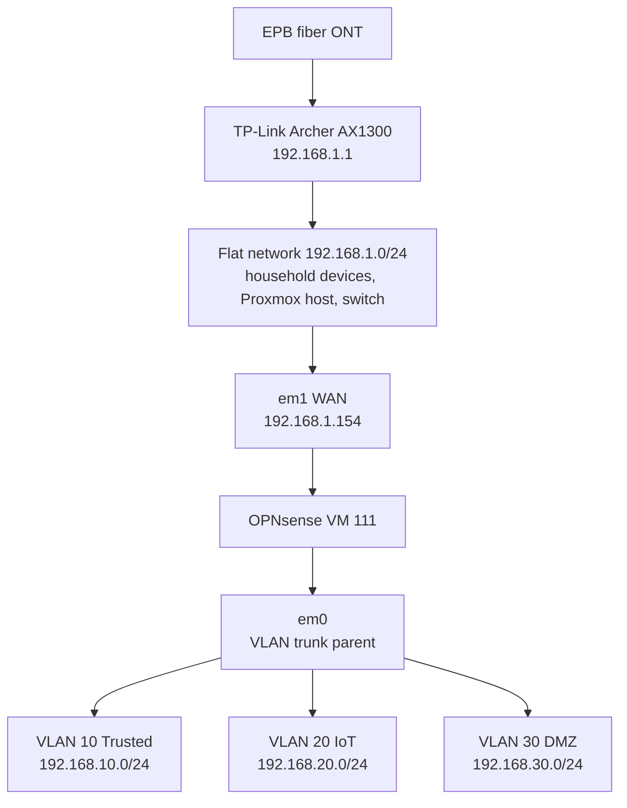

# Router Replacement & the Dual-Homed OPNsense Routing Bug

*September 25–26, 2026*

When the lab's edge router died and was replaced, every service on VLAN 10 lost internet access, even though the household network worked fine. The root cause turned out to be a design flaw that had been in place for months: OPNsense had **two interfaces on the same subnet**, and FreeBSD quietly chose the wrong one for its default route. The old router happened to hide it. The new one exposed it.

This write-up covers the topology, the symptoms, what was tried and failed, the permanent fix, and the follow-on issues it uncovered.

---

## Topology

OPNsense runs as a VM (VM 111) on Proxmox, behind a consumer router, which creates a double NAT. The household lives on the flat network. Lab services live on VLANs behind OPNsense.



**Before the fix**, em0 (LAN) also had an address on the flat network: `192.168.1.252/24`. So OPNsense had two interfaces on `192.168.1.0/24`, em0 (LAN, static) and em1 (WAN, DHCP).

## What happened

1. The ASUS RT-AC68U edge router failed and would not come back, even isolated.
2. A Netgear R6250 was used temporarily. It defaulted to `10.0.0.0/24`, which did not match the lab's addressing.
3. A TP-Link Archer AX1300 became the permanent edge router.

## Symptoms

- Household internet worked normally through the AX1300.
- OPNsense itself had internet access.
- Every VLAN 10 container (Pi-hole, Unbound, etc.) had **100% packet loss** to `8.8.8.8`.
- Pointing household DNS at Pi-hole broke household DNS entirely (twice), because Pi-hole couldn't reach the internet to resolve anything.
- Flat-network devices couldn't reach VLAN 10 at all until a static route (`192.168.10.0/24 via OPNsense`) was re-added on the new router. A replacement router starts with none of the old one's custom routes.
- NAT rules looked correct in `pfctl -s nat`. A reboot of OPNsense did not help.

## Diagnosis

The routing table on OPNsense showed the problem directly:

```
root@opnsense-01:~ # netstat -rn -f inet
Destination        Gateway            Flags     Netif
default            192.168.1.1        UGS       em0     <-- wrong interface
192.168.1.0/24     link#1             U         em0     <-- subnet bound to em0 only
192.168.1.154      link#3             UHS       lo0     (em1's own address)
192.168.1.252      link#3             UHS       lo0     (em0's own address)
192.168.10.0/24    link#7             U         vlan01
...
```

The default route pointed out **em0 (LAN)** instead of **em1 (WAN)**. Traffic leaving that way was never translated by the WAN outbound NAT, so replies never came back.

**Why:** when two interfaces share a subnet, FreeBSD keeps only one connected route for it. em0 had a static address, so it came up instantly and claimed `192.168.1.0/24` before em1 finished DHCP. Any gateway on `192.168.1.x`, including `192.168.1.1`, then resolves to em0. The GUI's gateway configuration was correct; the kernel's actual routing table ignored it.

**Why the ASUS didn't show this:** the same overlap existed under the ASUS. The most likely explanation is that em1 won the race under the old router's DHCP timing, and em0 wins it every time with the new one. Either way, the setup was working by luck, not by design.

## Attempted fixes that did NOT work

These are recorded so they aren't retried. Each one landed back on em0:

| Attempt | Command | Result |
|---|---|---|
| Force interface on add | `route add default 192.168.1.1 -ifp em1` | Default still on em0 |
| More-specific host route first | `route add -host 192.168.1.1 -interface em1`, then `route add default 192.168.1.1` | Host route landed on em1; default still on em0 |
| Change with interface + source address | `route change default 192.168.1.1 -ifp em1 -ifa 192.168.1.154` | Default still on em0 |

The conclusion was that no route command could win while em0 owned the subnet. The overlap itself had to go.

## The fix

Remove the overlap so em1 is OPNsense's **only** interface on `192.168.1.0/24`.

**1. Safety checks first (no changes)**
- Confirmed the VLANs' parent interface: `ifconfig vlan01 | grep parent` returned `em0`. So em0 must stay **enabled**; only its IP address is removed.
- Confirmed the Web GUI listens on **All** interfaces (System → Settings → Administration), so the GUI stays reachable at `192.168.10.1` after `.252` goes away.
- Downloaded a config backup (System → Configuration → Backups).

**2. Pin OPNsense's WAN address on the AX1300**
- DHCP address reservation: em1's MAC → `192.168.1.154`.

**3. Let the flat network in through WAN**
- Interfaces → WAN: **Block private networks** unchecked (already off).
- Firewall → Rules → WAN: pass, IPv4, any protocol, source `192.168.1.0/24` → destination `192.168.10.0/24`.
- In that rule's advanced options, **reply-to: disable**. By default, OPNsense forces replies to WAN-inbound traffic back through the WAN gateway (the AX1300) instead of directly to the client on the same subnet.

**4. Repoint the AX1300's static route**
- `192.168.10.0/24` gateway changed from `192.168.1.252` → `192.168.1.154`.

**5. Remove em0's address**
- Interfaces → LAN: IPv4 Configuration Type **Static → None**, *Enable Interface* left checked. The GUI at `.252` times out on apply, as expected.

## Verification

```
# OPNsense routing table after the change
192.168.1.0/24     link#2    U      em1     <-- subnet now on em1
default            192.168.1.1  UGS em1     <-- default on em1

# Pi-hole reaches the internet
root@lab-pve:~# pct exec 101 -- ping -c 3 8.8.8.8
3 packets transmitted, 3 received, 0% packet loss

# Unbound and Pi-hole resolve
pct exec 102 -- dig @127.0.0.1 -p 5335 google.com +short   # returns A records
pct exec 101 -- dig @127.0.0.1 google.com +short           # returns A records

# A flat-network laptop resolves through Pi-hole via the new WAN path
nslookup vault.meadows-lab.com 192.168.10.110   # -> 192.168.10.20 (Caddy)
```

After that, household DHCP was pointed at Pi-hole (**Primary DNS `192.168.10.110`, Secondary left blank** so clients can't bypass it). Household browsing worked normally.

**Reboot test:** OPNsense was rebooted and came back with the default route on **em1 on its own**. The fix survives reboots.

## Follow-on issues uncovered

Getting `opnsense.meadows-lab.com` working again (it had been down since August 19) exposed three more stale settings:

| Problem | Cause | Fix |
|---|---|---|
| Name timed out | Pi-hole Local DNS record pointed `opnsense.meadows-lab.com` at `192.168.1.254`, an address OPNsense hadn't used since August | Record changed to `192.168.10.20` (Caddy), matching every other lab name |
| Caddy couldn't reach OPNsense | Caddyfile upstream was also still `https://192.168.1.254:443` | Changed to `https://192.168.10.1:443` |
| Browser got an unstyled login, then `400 Bad Request` | OPNsense's web server rejected the HTTP/2 upstream connection from Caddy | Added `versions 1.1` to the upstream transport (and `header_up Host {upstream_hostport}`) |

Final Caddy block:

```
opnsense.meadows-lab.com {
    reverse_proxy https://192.168.10.1:443 {
        header_up Host {upstream_hostport}
        transport http {
            versions 1.1
            tls_insecure_skip_verify
        }
    }
}
```

## Lessons learned

- **Never put two interfaces on the same subnet** on a router. FreeBSD picks one silently, and the choice can flip with timing changes you don't control, like a new upstream router.
- **The GUI's gateway settings are not the live routing table.** Check `netstat -rn -f inet` for what the kernel is actually doing.
- **A VLAN parent interface doesn't need an IP.** em0 carries VLANs 10/20/30 with IPv4 set to None.
- **Replacing an edge router loses every custom setting**, including static routes, DHCP reservations and DNS. Keep a checklist.
- **When a service moves, grep everything for its old address**: DNS records, reverse proxy upstreams and monitors. The old `.254` lingered in two places for over a month.
- **Test the fix across a reboot** before calling it done, especially when part of the fix was applied by hand.

## Carry-forward

The planned dedicated OPNsense box (HP Z240) was staged with the same overlapping layout. The same design will be applied before its cutover: one interface on the flat network, VLANs on a parent interface with no IP.
