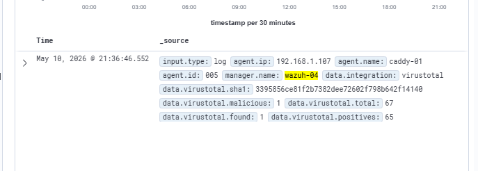

# VirusTotal + File Integrity Monitoring Integration

**Date:** May 10, 2026  
**Agent:** caddy-01 (LXC 105, Debian 12, 192.168.1.107)  
**Wazuh Manager:** wazuh-04 (VM 100, 192.168.1.140)

---

## Overview

Integrated Wazuh's File Integrity Monitoring (FIM) module with the VirusTotal API to enable automated malware detection. When a new file is added to a monitored directory, Wazuh FIM detects it, extracts the file hash, and submits it to VirusTotal. The result is logged as an alert in the Wazuh dashboard, including detection counts from 70+ AV engines.

---

## How It Works

1. Wazuh FIM monitors a directory in real time on the agent
2. A file is added to the monitored directory
3. FIM detects the change and triggers an alert containing the file hash
4. The VirusTotal integration (`integratord`) picks up the FIM alert
5. Wazuh sends the file hash to the VirusTotal API via HTTP POST
6. VirusTotal responds with a JSON report including detection results
7. Wazuh logs the result as a `virustotal` integration alert in the dashboard

---

## Configuration

### 1. VirusTotal Integration — Wazuh Manager

Added the following block to `/var/ossec/etc/ossec.conf` on wazuh-04, inside `<ossec_config>`:

```xml
<integration>
  <name>virustotal</name>
  <api_key>YOUR_VT_API_KEY</api_key>
  <group>syscheck</group>
  <alert_format>json</alert_format>
</integration>
```

- `<group>syscheck</group>` — tells Wazuh to trigger VirusTotal lookups on FIM alerts specifically
- `<alert_format>json</alert_format>` — required for the integration to parse the alert correctly

Restarted Wazuh manager to apply:

```bash
sudo /var/ossec/bin/wazuh-control restart
```

### 2. FIM Directory — Agent (caddy-01)

Added a real-time monitored directory to `/var/ossec/etc/ossec.conf` on caddy-01, inside the `<syscheck>` block:

```xml
<directories realtime="yes" check_all="yes">/tmp/vt-test</directories>
```

Created the directory and restarted the agent:

```bash
sudo mkdir /tmp/vt-test
sudo systemctl restart wazuh-agent
```

---

## Testing

Used the EICAR test file — a standard, harmless file recognized by all AV engines as malicious for testing purposes.

Downloaded EICAR to the monitored directory:

```bash
sudo curl -Lo /tmp/vt-test/eicar.com https://secure.eicar.org/eicar.com
```

---

## Result

Wazuh FIM detected the file immediately (realtime monitoring). The hash was submitted to VirusTotal and the result appeared in the Wazuh dashboard within seconds.

**Alert details:**

| Field | Value |
|---|---|
| agent.name | caddy-01 |
| agent.id | 005 |
| manager.name | wazuh-04 |
| data.integration | virustotal |
| data.virustotal.sha1 | 3395856ce81f2b7382dee72602f798b642f14140 |
| data.virustotal.found | 1 |
| data.virustotal.malicious | 1 |
| data.virustotal.positives | 65 |
| data.virustotal.total | 67 |

65 out of 67 AV engines flagged the file as malicious — confirming the full pipeline is working correctly.



---

## Notes

- VirusTotal free tier allows 500 API lookups per day — sufficient for homelab use
- The `/tmp/vt-test` directory is a test path; production monitoring is configured on `/etc`, `/usr/bin`, `/usr/sbin`, `/bin`, `/sbin`, `/boot` by default via the existing syscheck config
- FIM realtime monitoring requires `inotify` — supported on all Linux agents in this lab
- Future improvement: configure active response to automatically delete files flagged as malicious by VirusTotal
