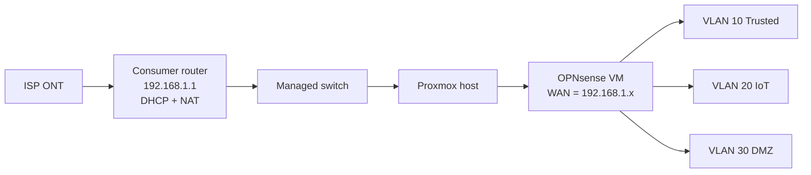
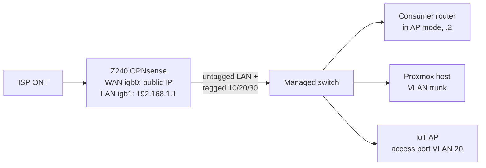

# Z240 Edge Cutover — Moving OPNsense from a VM to Dedicated Hardware (Round 2)

**Date:** October 6–10, 2026
**Result:** ✅ Success — about 56 minutes of household downtime, no rollback
**Follow-up to:** [z240-cutover-and-edge-router-failure.md](z240-cutover-and-edge-router-failure.md) (the failed August attempt)

## Overview

My firewall had been OPNsense running as a Proxmox VM behind a consumer router. That meant double NAT, a static route on the router back into the lab VLANs, a "No NAT" exception rule, a host route on Proxmox, and a firewall that went down whenever the host rebooted or ran out of memory. The fix was always dedicated hardware: an HP Z240 SFF with an Intel I340 4-port card.

The first attempt in August failed and took the house offline. This write-up covers the second attempt: what changed, how the cutover was staged so nothing could collide with the live network, and the one setting that most likely explains the August failure.

## Topology

**Before (double NAT):**



**After (OPNsense at the edge):**



## What Went Wrong in August, and the Counter-Measure

| August failure | Round 2 counter-measure |
|---|---|
| Onboard NIC (em0) was dead | Used only the Intel card: igb0 WAN, igb1 LAN |
| The VM "shut down" via ACPI but kept running — two firewalls on one IP | `qm stop` (hard power-off) and confirm with `qm status` before anything moves |
| The Z240 sat on the house network during setup; the GUI silently applied an old embedded IP and collided with the live firewall | Never on the house network before cutover: private cable at 192.168.99.x, interface IPs changed only at the console |
| Old router switched to AP mode first — its GUI vanished, no rollback | AP mode **last**, after every checkpoint, with a DHCP reservation so its address is known |
| Flat network lost DHCP when the old router stopped serving it | Kea DHCP on the Z240's LAN configured before cutover |
| Switch port for the firewall never tagged for the VLANs | Verified the VLAN table and PVIDs on the day |
| "ARP works, traffic doesn't" on every VLAN — never solved | **VLAN Hardware Filtering disabled** before cutover; a single checkpoint tests it |

## Phase 1 — Fresh Install and Update (isolated)

1. Booted the OPNsense 26.1 installer from USB, installed on ZFS (single-disk stripe).
2. The installer guessed the 10G SFP+ ports as LAN/WAN; reassigned at the console to **WAN igb0, LAN igb1**.
3. Set the LAN to **192.168.99.1/24** (DHCP off). This kept it off the house subnet so the WAN could borrow a 192.168.1.x address for updates without two interfaces sharing a subnet — the exact bug that had broken the old VM in September.
4. Link status, not port labels, decided which jack was which: `ifconfig igb0 | grep status; ifconfig igb1 | grep status`.
5. **Pings failed** after the reassignment: the default route was still bound to the installer's old LAN interface. A reboot fixed it.
6. Updated online to the same minor version as the VM (26.1.11) so the imported config would land on the version that wrote it. (Installer images exist only for major releases.)

## Phase 2 — Config Import by USB

The laptop has no Ethernet port, so importing through the web page would have required putting the Z240 on the house network — the August mistake. Instead:

1. Formatted a USB stick FAT32 and placed the VM's exported config at `conf/config.xml`.
2. **Renamed the NIC references inside the XML before importing.** The VM used `em0`/`em1`; the Z240 has `igb0`/`igb1`. Listing every interface tag first showed exactly five:

   ```powershell
   Select-String -Path E:\conf\config.xml -Pattern '\bem[01]\b'
   ```

   Then only the exact tags were replaced (no BOM written), re-listed, and the file was parse-checked:

   ```powershell
   $f='E:\conf\config.xml'; $t=[IO.File]::ReadAllText($f)
   $t=$t.Replace('<if>em0</if>','<if>igb1</if>').Replace('<if>em1</if>','<if>igb0</if>')
   [IO.File]::WriteAllText($f,$t)
   [xml](Get-Content $f -Raw) | Out-Null; 'XML OK'
   ```

3. On the Z240 console: `opnsense-importer` → select the USB device → reboot, with **no network cables attached**.
4. It came up with the VM's hostname, rules and VLANs — and **no interface-mismatch prompt**. `ifconfig vlan01` confirmed the VLANs were parented to igb1. (In August the VLANs stayed attached to the non-existent em0.)

## Phase 3 — Prep Over a Private Cable

A wired PC connected directly to the Z240's LAN port at 192.168.99.10. Even if the GUI applied a wrong address, the only thing that could see it was that one PC.

- **Interfaces → Settings → VLAN Hardware Filtering: Disable.** Afterwards the LAN interface's active options no longer listed `vlan_hwfilter` or `vlan_hwtagging` (the card is capable of both; they're just off).
- **Kea DHCP** on the LAN: pool `.110–.199` — deliberately skipping the Proxmox host and the switch, because Kea doesn't ping-check before leasing. Reservations for the media server and the future AP.
- **WAN hardening:** Block private networks and bogon networks back on (they had to be off while the VM's WAN lived on a private subnet).
- **Retired the double-NAT workarounds:** deleted the WAN "flat → Trusted" rule and the outbound "No NAT" exception.
- Verified all VLAN interfaces were enabled with /24 masks (in August a reassignment had flipped one to /32).
- Downloaded a save point of the prepared config.

## Phase 4 — Cutover

Run from a wired PC on the switch (testing) and a phone on mobile data (communication), so no one had to hop between Wi-Fi networks mid-outage.

1. Z240 LAN set to **192.168.1.1** at the console, still with no cables.
2. Proxmox: commented out the boot-time route to the VLANs through the VM's old address (before the outage, since it only matters at reboot).
3. **Outage starts:** `qm stop` on the VM → `qm status` = stopped → disable start-at-boot → delete the live host route.
4. Recable: old router unplugged from the switch **first** (so two devices never hold .1 on the same wire), ISP cable → Z240 WAN, Z240 LAN → switch trunk port.
5. Checkpoints, stopping at the first failure:

| # | Test | Result |
|---|---|---|
| 1 | Z240 WAN gets a public IP | ✅ New public IP immediately — the ISP had no MAC binding to the old router |
| 2 | Z240 pings the internet | ✅ |
| 3 | Wired PC gets its reserved address from Kea | ⚠️ Timed out → Kea restart → ✅ |
| 4 | **Z240 pings Pi-hole across VLAN 10** (August's failure point) | ✅ First try |
| 5 | DNS through Pi-hole + browsing | ✅ |
| 6 | Lab sites, NFS storage, uptime monitor, SIEM agents, dashboard | ✅ 13/13 monitors up |

6. **Old router → access point, last.** Switched its mode, then plugged it straight back into the switch during its reboot. In AP mode it stops serving DHCP, so leaving it unplugged would have left Wi-Fi clients with no address and made its admin page unreachable — the August trap in a new form. Plugged in, its clients got leases from the Z240 and Wi-Fi came back. A DHCP reservation pinned it to a known address.
7. IoT TV streaming from the media server and the thermostat both verified. **Outage ends.**

## Verification Afterwards

- Searched every container and the Proxmox host for the VM's retired WAN address — only the commented-out line remained.
- The IoT VLAN, its access-port AP and its firewall rules carried over untouched in the imported config.
- The old VM is stopped but kept intact as a rollback path for a couple of weeks.

## Lessons

- **Isolate until the moment of cutover.** Every August problem got worse because the new box shared a network with the old one. A private cable and a throwaway subnet made the whole prep phase risk-free.
- **Edit the config for the new hardware, don't remap after.** Renaming NIC tags in the XML gave a clean import with VLANs on the right parent.
- **Reboot after reassigning interfaces.** Routes don't follow the reassignment.
- **Restart Kea after changing the LAN address at the console** — it kept serving the old setup until restarted.
- **Disable VLAN Hardware Filtering on Intel igb cards** carrying VLANs in OPNsense. It was the only VLAN-related change between August and October, and the August symptom (ARP succeeds, nothing else crosses) disappeared.
- **Check port mapping by link status**, not by labels.
- **Plan the communication channel.** Testing from a wired PC and talking over mobile data avoided the August Wi-Fi juggling.
- **Change the old router last, and keep it reachable.** A known reserved address and plugging it straight back in kept the GUI available.

## Still Open

- Enroll the new firewall's Wazuh agent (the agent key isn't part of the exported config, so it needs a fresh enrollment).
- Tighten LAN → DMZ access now that the house network reaches every VLAN directly.
- WireGuard: dynamic DNS and a port forward on the new edge.
- Redraw the network diagram.
